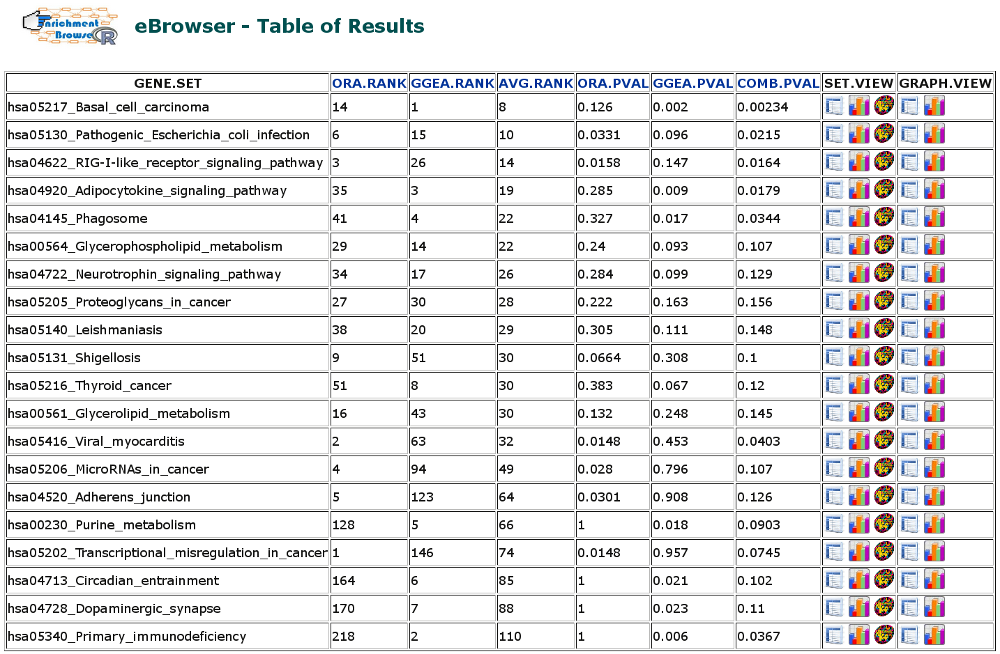

```{r, include = FALSE}
knitr::opts_chunk$set(
  collapse = TRUE,eval = T,
  comment = "#>",
  dev = "jpeg"
)
```

Report issues on <https://github.com/lgeistlinger/EnrichmentBrowser/issues>

# Introduction

The package `r Biocpkg("EnrichmentBrowser")` implements essential functionality for the enrichment analysis of gene expression data. The analysis combines the advantages of set-based and network-based enrichment analysis to derive high-confidence gene sets and biological pathways that are differentially regulated in the expression data under investigation. Besides, the package facilitates the visualization and exploration of such sets and pathways. The following instructions will guide you through an end-to-end expression data analysis workflow including:

1.  Preparing the data

2.  Preprocessing of the data

3.  Differential expression (DE) analysis

4.  Defining gene sets of interest

5.  Executing individual enrichment methods

6.  Combining the results of different methods

7.  Visualize and explore the results

    All of these steps are modular, i.e. each step can be executed individually and fine-tuned with several parameters. In case you are interested in a particular step, you can directly move on to the respective section. For example, if you have differential expression already calculated for each gene, and your are now interested whether certain gene functions are enriched for differential expression, section \@ref(sec:setbased) would be the one you should go for. The last section \@ref(sec:summary) also demonstrates how to wrap the whole workflow into a single function, making use of suitably chosen defaults.

```{r setup, message = FALSE,echo = FALSE }
library(EnrichmentBrowser)
library(ALL)
library(airway)
```

# Reading expression data from file

Typically, the expression data is not already available in *R* but rather has to be read in from file. This can be done using the function `readSE`, which reads the expression data (`exprs`) along with the phenotype data (`colData`) and feature data (`rowData`) into a `r Biocpkg("SummarizedExperiment")`.

```{r readSE}
library(EnrichmentBrowser)
data.dir <- system.file("extdata", package = "EnrichmentBrowser")
exprs.file <- file.path(data.dir, "exprs.tab")
cdat.file <- file.path(data.dir, "colData.tab")
rdat.file <- file.path(data.dir, "rowData.tab")
se <- readSE(exprs.file, cdat.file, rdat.file)
```

The man pages provide details on file format and the *SummarizedExperiment* data structure.

```{r help, eval=FALSE}
?readSE 
?SummarizedExperiment
```

*Note:* Previous versions of the `r Biocpkg("EnrichmentBrowser")` used the *ExpressionSet* data structure. The migration to *SummarizedExperiment* in the current release of the `r Biocpkg("EnrichmentBrowser")` is done to reflect recent developments in *Bioconductor*, which discourage use of *ExpressionSet* in favor of *SummarizedExperiment*. Major reasons are the compatibility of *SummarizedExperiment* with operations on genomic regions as well as efficient dealing with big data.

To enable a smooth transition, all functions of the `r Biocpkg("EnrichmentBrowser")` are still accepting also an *ExpressionSet* as input, but are consistently returning a *SummarizedExperiment* as output.

Furthermore, users can always coerce from *SummarizedExperiment* to *ExpressionSet* via

```{r sexp2eset}
eset <- as(se, "ExpressionSet")
```

and vice versa

```{r eset2sexp}
se <- as(eset, "SummarizedExperiment")
```

# Types of expression data

The two major data types processed by the `r Biocpkg("EnrichmentBrowser")` are microarray (intensity measurements) and RNA-seq (read counts) data.

Although RNA-seq has become the *de facto* standard for transcriptomic profiling, it is important to know that many methods for differential expression and gene set enrichment analysis have been originally developed for microarray data.

However, differences in data distribution assumptions (microarray: quasi-normal, RNA-seq: negative binomial) made adaptations in differential expression analysis and, to some extent, also in gene set enrichment analysis necessary.

Thus, we consider two example data sets -- a microarray and a RNA-seq data set, and discuss similarities and differences of the respective analysis steps.

## Microarray data

To demonstrate the functionality of the package for microarray data, we consider expression measurements of patients with acute lymphoblastic leukemia [@chiaretti2004]. A frequent chromosomal defect found among these patients is a translocation, in which parts of chromosome 9 and 22 swap places. This results in the oncogenic fusion gene BCR/ABL created by positioning the ABL1 gene on chromosome 9 to a part of the BCR gene on chromosome 22.

We load the `r Biocpkg("ALL")` dataset

```{r load-ALL}
library(ALL) 
data(ALL)
```

and select B-cell ALL patients with and without the BCR/ABL fusion as described previously [@bioinfor2005].

```{r subset-ALL}
ind.bs <- grep("^B", ALL$BT)
ind.mut <- which(ALL$mol.biol %in% c("BCR/ABL", "NEG"))
sset <- intersect(ind.bs, ind.mut)
all.eset <- ALL[, sset]
```

We can now access the expression values, which are intensity measurements on a log-scale for 12,625 probes (rows) across 79 patients (columns).

```{r show-ALL}
dim(all.eset) 
exprs(all.eset)[1:4,1:4]
```

As we often have more than one probe per gene, we summarize gene expression values as the average of the corresponding probe values.

```{r probe2gene,message = FALSE}
allSE <- probe2gene(all.eset)
head(rownames(allSE))
```

Note, that the mapping from probe to gene is done automatically as long as as you have the corresponding annotation package, here the `r Biocpkg("hgu95av2.db")` package, installed. Otherwise, the mapping can be manually defined in the `rowData` slot.

```{r show-probe2gene}
rowData(se)
```

## RNA-seq data

To demonstrate the functionality of the package for RNA-seq data, we consider transcriptome profiles of four primary human airway smooth muscle cell lines in two conditions: control and treatment with dexamethasone [@himes2014].

We load the `r Biocpkg("airway")` dataset

```{r load-airway}
library(airway) 
data(airway)
```

For further analysis, we remove genes with very low read counts and measurements that are not mapped to an ENSEMBL gene ID.

```{r preproc-airway}
airSE <- airway[grep("^ENSG", rownames(airway)),] 
airSE <- airSE[rowSums(assay(airSE)) > 4,]
dim(airSE) 
assay(airSE)[1:4,1:4]
```

# Normalization

Normalization of high-throughput expression data is essential to make results within and between experiments comparable. Microarray (intensity measurements) and RNA-seq (read counts) data typically show distinct features that need to be normalized for. The function `normalize` wraps commonly used functionality from `r Biocpkg("limma")` for microarray normalization and from `r Biocpkg("EDASeq")` for RNA-seq normalization. For specific needs that deviate from these standard normalizations, the user should always refer to more specific functions/packages.

Microarray data is expected to be single-channel. For two-color arrays, it is expected that normalization within arrays has been already carried out, e.g. using from `normalizeWithinArrays` from `r Biocpkg("limma")`.

A default quantile normalization based on `normalizeBetweenArrays` from `r Biocpkg("limma")` can be carried out via

```{r norm-ma}
allSE <- normalize(allSE, norm.method = "quantile")
```

```{r plot-norm, fig.width=12, fig.height=6}
par(mfrow=c(1,2))
boxplot(assay(allSE, "raw")) 
boxplot(assay(allSE, "norm"))
```

Note that this is only done for demonstration, as the ALL data has been already RMA-normalized by the authors of the ALL dataset.

RNA-seq data is expected to be raw read counts. Note that normalization for downstream DE analysis, e.g.with `r Biocpkg("edgeR")` and `r Biocpkg("DESeq2")`, is not ultimately necessary (and in some cases even discouraged) as many of these tools implement specific normalization approaches themselves. See the vignette of `r Biocpkg("EDASeq")`, `r Biocpkg("edgeR")`, and `r Biocpkg("DESeq2")` for details.

In case normalization is desired, between-lane normalization to adjust for sequencing depth can be carried out as demonstrated for microarray data.

```{r norm-rseq, eval = FALSE}
airSE <- normalize(airSE, norm.method = "quantile")
```

Within-lane normalization to adjust for gene-specific effects such as gene length and GC-content requires to retrieve this information first, e.g. from *BioMart* or specific *Bioconductor* annotation packages. Both modes are implemented in the `r Biocpkg("EDASeq")` function `getGeneLengthAndGCContent`.

# Differential expression

The `r Biocpkg("EnrichmentBrowser")` incorporates established functionality from the `r Biocpkg("limma")` package for differential expression analysis between sample groups. This involves the `voom`-transformation when applied to RNA-seq data. Alternatively, differential expression analysis for RNA-seq data can also be carried out based on the negative binomial distribution with `r Biocpkg("edgeR")` and `r Biocpkg("DESeq2")` .

This can be performed using the function `deAna` and assumes some standardized variable names:

-   **GROUP** defines the sample groups being contrasted,

-   **BLOCK** defines paired samples or sample blocks, as e.g. for batch effects.

For more information on experimental design, see the [limma user's guide](http://bioconductor.org/packages/limma), chapter 9.

For the ALL dataset, the **GROUP** variable indicates whether the BCR-ABL gene fusion is present (1) or not (0).

```{r sample-groups-ALL}
 allSE$GROUP <- ifelse(allSE$mol.biol =="BCR/ABL", 1, 0) 
 table(allSE$GROUP)
```

For the airway dataset, it indicates whether the cell lines have been treated with dexamethasone (1) or not (0).

```{r sample-groups-airway}
airSE$GROUP <- ifelse(airway$dex == "trt", 1, 0)
table(airSE$GROUP)
```

Paired samples, or in general sample batches/blocks, can be defined via a **BLOCK** column in the `colData` slot. For the airway dataset, the sample blocks correspond to the four different cell lines.

```{r sample-blocks}
airSE$BLOCK <- airway$cell 
table(airSE$BLOCK)
```

For microarray expression data, the `deAna` function carries out a differential expression analysis between the two groups based on functionality from the `r Biocpkg("limma")` package. Resulting fold changes and *t*-test derived *p*-values for each gene are appended to the `rowData` slot.

```{r DE-ana-ALL}
allSE <- deAna(allSE, padj.method = "BH")
rowData(allSE)
```

Nominal *p*-values (`PVAL`) are corrected for multiple testing (`ADJ.PVAL`) using the method from Benjamini and Hochberg implemented in the function`p.adjust` from the `r CRANpkg("stats")` package.

To get a first overview, we inspect the *p*-value distribution and the volcano plot (fold change against *p*-value).

```{r}
par(mfrow = c(1,2))
pdistr(rowData(allSE)$PVAL)
volcano(rowData(allSE)$FC, rowData(allSE)$ADJ.PVAL)
```

The expression change of highest statistical significance is observed for the ENTREZ gene 7525.

```{r DE-exmpl}
ind.min <- which.min(rowData(allSE)$ADJ.PVAL) 
rowData(allSE)[ind.min,]
```

This turns out to be the YES proto-oncogene 1 ([hsa:7525\@KEGG](http://www.genome.jp/dbget-bin/www_bget?hsa:7525)).

For RNA-seq data, the `deAna` function carries out a differential expression analysis between the two groups either based on functionality from `r Biocpkg("limma")` (that includes the `voom` transformation), or alternatively, the popular `r Biocpkg("edgeR")` or `r Biocpkg("DESeq2")` package.

Here, we use the analysis based on `r Biocpkg('edgeR')` for demonstration.

```{r DE-ana-airway}
airSE <- deAna(airSE, de.method = "edgeR")
rowData(airSE)
```

# ID mapping {#sec:idmap}

Using genomic information from different resources often requires mapping between different types of gene identifiers. Although primary analysis steps such as normalization and differential expression analysis can be carried out independent of the gene ID type, downstream exploration functionality of the `r Biocpkg("EnrichmentBrowser")` is consistently based on NCBI Entrez Gene IDs. It is thus, in this regard, beneficial to initially map gene IDs of a different type to NCBI Entrez IDs.

The function `idTypes` lists the available ID types for the mapping depending on the organism under investigation.

```{r idmap-idtypes}
 idTypes("hsa")
```

ID mapping for the airway dataset (from ENSEMBL to ENTREZ gene ids) can then be carried out using the function `idMap`.

```{r idmap-airway, message=FALSE}
head(rownames(airSE)) 
airSE <- idMap(airSE, org ="hsa", from = "ENSEMBL", to = "ENTREZID") 
head(rownames(airSE))
```

Now, we subject the ALL and the airway gene expression data to the enrichment analysis.

# Enrichment analysis

In the following, we introduce how the `r Biocpkg('EnrichmentBrowser')` package can be used to perform state-of-the-art enrichment analysis of gene sets. We consider the ALL and the airway gene expression data as processed in the previous sections. We are now interested in whether pre-defined sets of genes that are known to work together, e.g. as defined in the Gene Ontology (GO) or the KEGG pathway annotation, are coordinately differentially expressed.

## Obtaining gene sets

The function `getGenesets` can be used to download gene sets from databases such as GO and KEGG. We can use the function to download all KEGG pathways for a chosen organism (here: *Homo sapiens*) as gene sets.

```{r get-kegg-gs, eval=FALSE}
 kegg.gs <- getGenesets(org = "hsa", db = "kegg")
```

Analogously, the function `getGenesets` can be used to retrieve GO terms of a selected ontology (here: biological process, BP) as defined in the `r Biocpkg('GO.db')` annotation package.

```{r get-go-gs, eval=FALSE}
 go.gs <- getGenesets(org = "hsa", db = "go", onto = "BP", mode = "GO.db")
```

If provided a file, the function parses user-defined gene sets from GMT file format. Here, we use this functionality for reading a list of already downloaded KEGG gene sets for *Homo sapiens* containing NCBI Entrez Gene IDs.

```{r parseGMT}
gmt.file <- file.path(data.dir, "hsa_kegg_gs.gmt")
hsa.gs <- getGenesets(gmt.file) 
length(hsa.gs) 
hsa.gs[1:2]
```

Note #1: Use `getGenesets` with `db = "msigdb"` to obtain gene set collections for 11 different species from the [Molecular Signatures Database (MSigDB)](http://software.broadinstitute.org/gsea/msigdb/collections.jsp). Analogously, `getGenesets` with `db = "enrichr"` allows to obtain gene set libraries from the comprehensive [Enrichr collection](https://amp.pharm.mssm.edu/Enrichr/#stats) for 5 different species.

Note #2: The `idMap` function can be used to map gene sets from NCBI Entrez Gene IDs to other common gene ID types such as ENSEMBL gene IDs or HGNC symbols as described in Section \@ref(sec:idmap).

## Set-based enrichment analysis {#sec:setbased}

Currently, the following set-based enrichment methods are supported

```{r sbeaMethods}
sbeaMethods()
```

-   ORA: Overrepresentation Analysis (simple and frequently used test based on the hypergeometric distribution, see [@Goeman2007] for a critical review),

-   SAFE: Significance Analysis of Function and Expression (resampling version of ORA, implements additional test statistics, e.g. Wilcoxon's rank sum, and allows to estimate the significance of gene sets by sample permutation; implemented in the `r Biocpkg("safe")` package),

-   GSEA: Gene Set Enrichment Analysis (frequently used and widely accepted, uses a Kolmogorov--Smirnov statistic to test whether the ranks of the *p*-values of genes in a gene set resemble a uniform distribution [@subramanian2005]),

-   PADOG: Pathway Analysis with Down-weighting of Overlapping Genes (incorporates gene weights to favor genes appearing in few pathways versus genes that appear in many pathways; implemented in the `r Biocpkg("PADOG")` package),

-   ROAST: ROtAtion gene Set Test (uses rotation instead of permutation for assessment of gene set significance; implemented in the `r Biocpkg('limma')` and `r Biocpkg("edgeR")` packages for microarray and RNA-seq data, respectively),

-   CAMERA: Correlation Adjusted MEan RAnk gene set test (accounts for inter-gene correlations as implemented in the `r Biocpkg("limma")` and `r Biocpkg("edgeR")` packages for microarray and RNA-seq data, respectively),

-   GSA: Gene Set Analysis (differs from GSEA by using the maxmean statistic, i.e. the mean of the positive or negative part of gene scores in the gene set; implemented in the `r Biocpkg("GSA")` package),

-   GSVA: Gene Set Variation Analysis (transforms the data from a gene by sample matrix to a gene set by sample matrix, thereby allowing the evaluation of gene set enrichment for each sample; implemented in the `r Biocpkg("GSVA")` package)

-   GLOBALTEST: Global testing of groups of genes (general test of groups of genes for association with a response variable; implemented in the `r Biocpkg("globaltest")` package),

-   SAMGS: Significance Analysis of Microarrays on Gene Sets (extending the SAM method for single genes to gene set analysis [@Dinu2007]),

-   EBM: Empirical Brown's Method (combines *p*-values of genes in a gene set using Brown's method to combine *p*-values from dependent tests; implemented in `r Biocpkg("EmpiricalBrownsMethod")`),

-   MGSA: Model-based Gene Set Analysis (Bayesian modeling approach taking set overlap into account by working on all sets simultaneously, thereby reducing the number of redundant sets; implemented in `r Biocpkg("mgsa")`).

See also Appendix \@ref(sec:primer) for a comprehensive introduction on underlying statistical concepts.

## Guidelines for input and method selection

We recently performed a comprehensive assessment of the availabe set-based enrichment methods, and identified significant differences in runtime and applicability to RNA-seq data, fraction of enriched gene sets depending on the null hypothesis tested, and detection of relevant processes [@geistlinger2020]. Based on these results, we make practical recommendations on how methods originally developed for microarray data can efficiently be applied to RNA-seq data, how to interpret results depending on the type of gene set test conducted and which methods are best suited to effectively prioritize gene sets with high phenotype relevance:

-   for the exploratory analysis of **simple gene lists**, we recommend ORA given its ease of applicability, fast runtime and evident relevance of resulting gene set rankings, provided that input gene list and reference gene list are chosen carefully and remembering ORA's propensity for type I error rate inflation when genes tend to be co-expressed within sets.

-   for the analysis of **pre-ranked gene lists** accompanied by gene scores such as fold changes, alternatives to ORA such as pre-ranked GSEA or pre-ranked CAMERA exist.

-   for expression-based enrichment analysis on the **full expression matrix**, we recommend providing normalized log2 intensities for microarray data, and logTPMs (or logRPKMs / logFPKMs) for RNA-seq data. When given raw read counts, we recommend to apply a variance-stabilizing transformation such as `voom` to arrive at library-size normalized logCPMs.

-   if the question of interest is to test for association of any gene in the set with the phenotype (**self-contained** null hypothesis), we recommend ROAST or GSVA that both test a **directional** hypothesis (genes in the set tend to be either predominantly up- or down-regulated). Both methods can be applied for simple or extended experimental designs, where ROAST is the more natural choice for the comparison of sample groups and also allows one to test a **mixed** hypothesis (genes in the set tend to be differentially expressed, regardless of the direction). The main strength of GSVA lies in its capabilities for analyzing single samples.

-   if the question of interest is to test for excess of differential expression in a gene set relative to genes outside the set (**competitive** null hypothesis), which we believe comes closest to the expectations and intuition of most end users when performing GSEA, we recommend PADOG, which is slower to run but resolves major shortcomings of ORA, and has desirable properties for the analyzed criteria and when compared to other competitive methods. However, PADOG is limited to testing a mixed hypothesis in a comparison of two sample groups, optionally including paired samples or sample batches. Therefore, we recommend the highly customizable SAFE for testing a directional hypothesis or in situations of more complex experimental designs such as comparisons between multiple groups, continuous phenotypes or the presence of covariates.

See also Reference [@geistlinger2020] for the results of the benchmarking study and the `r Biocpkg("GSEABenchmarkeR")` package for a general framework for reproducible benchmarking of gene set enrichment methods.

### Microarray data

Given normalized log2 intensities for the ALL microarray dataset, a basic ORA can be carried out via

```{r sbea}
sbea.res <- sbea(method = "ora", se = allSE, gs = hsa.gs, perm = 0, alpha = 0.1) 
gsRanking(sbea.res)
```

Note that we set `perm = 0` to invoke the classical hypergeometric test without sample permutation, and that we chose a significance level $\alpha$ of 0.1 for demonstration purposes.

### RNA-seq data

When analyzing RNA-seq datasets with expression values given as logTPMs (or logRPKMs / logFPKMs), the available set-based enrichment methods can be applied as for microarray data. However, when given raw read counts as for the airway dataset, we recommend to first apply a variance-stabilizing transformation such as `voom` to arrive at library-size normalized logCPMs.

```{r vst, message=FALSE}
 airSE <- normalize(airSE, norm.method = "vst")
```

The mean-variance relationship of the transformed data is similar to what is observed for microarray data, simplifying the application of legacy enrichment methods such as GSEA and PADOG to RNA-seq data, and enable the use of fast and established methods.

```{r gsea-rseq, eval=FALSE}
air.res <- sbea(method = "gsea", se = airSE, gs = hsa.gs) 
gsRanking(sbea.res)
```

## Result exploration

The result of every enrichment analysis is a ranking of gene sets by the corresponding *p*-value. The `gsRanking` function displays by default only those gene sets satisfying the chosen significance level $\alpha$, but we can use to obtain the full ranking.

```{r fullrank}
 gsRanking(sbea.res, signif.only = FALSE)
```

While such a ranked list is the standard output of existing enrichment tools, the package `r Biocpkg("EnrichmentBrowser")` provides visualization and interactive exploration of resulting gene sets far beyond that point. Using the `eaBrowse` function creates a HTML summary from which each gene set can be inspected in detail (this builds on functionality from the `r Biocpkg("ReportingTools")` package).

The various options are described in Figure \@ref(fig:oraRes).

```{r eaBrowse, eval=FALSE}
 eaBrowse(sbea.res)
```

{width="20cm" height="8.75cm"}

## Network-based enrichment analysis

Having found sets of genes that are differentially regulated in the ALL data, we are now interested whether these findings can be supported by known regulatory interactions.

For example, we want to know whether transcription factors and their target genes are expressed in accordance to the connecting regulations (activation/inhibition). Such information is usually given in a gene regulatory network derived from specific experiments or compiled from the literature ([@geistlinger2013] for an example).

There are well-studied processes and organisms for which comprehensive and well-annotated regulatory networks are available, e.g. the `RegulonDB` for *E. coli* and `Yeastract` for *S. cerevisiae*. However, there are also cases where such a network is missing. A basic workaround is to compile a network from regulations in pathway databases such as KEGG.

```{r compile-grn}
hsa.grn <- compileGRN(org="hsa", db="kegg")
head(hsa.grn)
```

Now, we are able to perform enrichment analysis using the compiled network. Currently, the following network-based enrichment analysis methods are supported

```{r nbeaMethods}
 nbeaMethods()
```

-   GGEA: Gene Graph Enrichment Analysis (evaluates consistency of known regulatory interactions with the observed expression data [@Geistlinger2011]),

-   SPIA: Signaling Pathway Impact Analysis (combines ORA with the probability that expression changes are propagated across the pathway topology; implemented in the `r Biocpkg('SPIA')` package),

-   PathNet: Pathway Analysis using Network Information (applies ORA on combined evidence for the observed signal for gene nodes and the signal implied by connected neighbors in the network; implemented in the `r Biocpkg('PathNet')` package),

-   DEGraph: Differential expression testing for gene graphs (multivariate testing of differences in mean incorporating underlying graph structure; implemented in the `r Biocpkg("DEGraph")` package),

-   TopologyGSA: Topology-based Gene Set Analysis (uses Gaussian graphical models to incorporate the dependence structure among genes as implied by pathway topology; implemented in the `r Biocpkg("topologyGSA")` package),

-   GANPA: Gene Association Network-based Pathway Analysis (incorporates network-derived gene weights in the enrichment analysis; implemented in the `r Biocpkg("GANPA")` package),

-   CePa: Centrality-based Pathway enrichment (incorporates network centralities as node weights mapped from differentially expressed genes in pathways; implemented in the `r CRANpkg('CePa')` package),

-   NetGSA: Network-based Gene Set Analysis (incorporates external information about interactions among genes as well as novel interactions learned from data; implemented in the `r Biocpkg("NetGSA")` package),

For demonstration, we perform GGEA using the compiled KEGG regulatory network.

```{r nbea}
nbea.res <- nbea(method="ggea", se=allSE, gs=hsa.gs, grn=hsa.grn) 
gsRanking(nbea.res)
```

The resulting ranking lists, for each statistically significant gene set, the number of relations of the network involving a member of the gene set under study (`NR.RELS`), the sum of consistencies over the relations of the set (`RAW.SCORE`), the score normalized by induced network size (`NORM.SCORE` = `RAW.SCORE` / `NR.RELS`), and the statistical significance of each gene set based on a permutation approach.

A GGEA graph for a gene set depicts the consistency of each interaction in the set. Nodes (genes) are colored according to expression (up-/down-regulated) and edges (interactions) are colored according to consistency, i.e. how well the interaction type (activation/inhibition) is reflected in the correlation of the observed expression of both interaction partners.

```{r ggea-graph, fig.width=12, fig.height=6}
par(mfrow=c(1,2))
ggeaGraph( gs=hsa.gs[["hsa05217_Basal_cell_carcinoma"]], grn=hsa.grn, se=allSE) 
ggeaGraphLegend()
```

## User-defined enrichment methods

The goal of the `r Biocpkg("EnrichmentBrowser")` package is to provide frequently used enrichment methods. However, it is also possible to exploit its visualization capabilities with user-defined set-based enrichment methods.

This requires to implement a function that takes the characteristic arguments `se` (expression data) and `gs` (gene sets).

In addition, it must return a numeric vector `ps` storing the resulting *p*-value for each gene set in `gs`. The *p*-value vector must also be named accordingly (i.e.`names(ps) == names(gs)`).

Let us consider the following dummy enrichment method, which randomly renders five gene sets significant and the remaining insignificant.

```{r dummySBEA}
 dummySBEA <- function(se, gs) {
   sig.ps <- sample(seq(0, 0.05, length = 1000), 5) 
   insig.ps <- sample(seq(0.1, 1, length = 1000), length(gs) - 5) 
   ps <- sample(c(sig.ps, insig.ps), length(gs)) 
   names(ps) <- names(gs) 
   return(ps)
 }
```

We can plug this method into `sbea` as before.

```{r sbea2}
sbea.res2 <- sbea(method = dummySBEA, se = allSE, gs = hsa.gs) 
gsRanking(sbea.res2)
```

As described in the previous section, it is also possible to analogously plug in user-defined network-based enrichment methods into `nbea.`

# Combining results

Different enrichment analysis methods usually result in different gene set rankings for the same dataset. To compare results and detect gene sets that are supported by different methods, the `r Biocpkg("EnrichmentBrowser")` package allows to combine results from the different set-based and network-based enrichment analysis methods. The combination of results yields a new ranking of the gene sets under investigation by specified ranking criteria, e.g. the average rank across methods. We consider the ORA result and the GGEA result from the previous sections and use the function `combResults`.

```{r combine}
res.list <- list(sbea.res, nbea.res) 
comb.res <- combResults(res.list)
```

The combined result can be detailedly inspected as before and interactively ranked as depicted in Figure \@ref(fig:browsecomb).

```{r browse-comb, eval=FALSE}
eaBrowse(comb.res, graph.view=hsa.grn, nr.show=5)
```

{width="20cm" height="6.8cm"}

# Putting it all together {#sec:summary}

There are cases where it is necessary to perform certain steps of the demonstrated enrichment analysis pipeline individually. However, it is often more convenient to run the complete standardized pipeline. This can be done using the all-in-one wrapper function `ebrowser`. For example, the result page displayed in Figure \@ref(fig:browsecomb) can also be produced from scratch via

```{r all-in-one, eval=FALSE}
ebrowser( meth=c("ora", "ggea"), exprs=exprs.file, cdat=cdat.file, rdat=rdat.file, org="hsa", gs=hsa.gs, grn=hsa.grn, comb=TRUE, nr.show=5)
```

# Advanced: configuration parameters {#sec:config}

Similar to *R*'s options settings, the `r Biocpkg("EnrichmentBrowser")` uses certain package-wide configuration parameters, which affect the way in which analysis is carried out and how results are displayed. The settings of these parameters can be examined and, to some extent, also changed using the function `configEBrowser`. For instance, the default directory where the `r Biocpkg("EnrichmentBrowser")` writes results to can be updated via

```{r config-set}
configEBrowser(key="OUTDIR.DEFAULT", value="/my/out/dir")
```

and examined via

```{r config-get}
configEBrowser("OUTDIR.DEFAULT")
```

Note that changing these defaults should be done with care, as inappropriate settings might impair the package's functionality. The complete list of incorporated configuration parameters along with their default settings can be inspected via

```{r config-man, eval=FALSE}
?configEBrowser
```

# For non-R users: command line invocation {#sec:cmd}

The package source contains two scripts in `inst/scripts` to invoke the EnrichmentBrowser from the command line using *Rscript*.

The `de_rseq.R` script is a lightweight wrapper script to carry out differential expression analysis of RNA-seq data either based on `r Biocpkg("limma")` (using the `voom`-transformation), `r Biocpkg("edgeR")`, or `r Biocpkg("DESeq2")`.

The `eBrowserCMD.R` implements the full functionality and allows to carry out the various enrichment methods and to produce HTML reports for interactive exploration of results.

The `inst/scripts` folder also contains a `README` file that comprehensively documents the usage of both scripts.

# A primer on terminology and statistical theory {#sec:primer}

## Where does it all come from? {#sec:ora}

Test whether known biological functions or processes are over-represented (= enriched) in an experimentally-derived gene list, e.g. a list of differentially expressed (DE) genes. See [@Goeman2007] for a critical review.

Example: Transcriptomic study, in which 12,671 genes have been tested for differential expression between two sample conditions and 529 genes were found DE.

Among the DE genes, 28 are annotated to a specific functional gene set, which contains in total 170 genes. This setup corresponds to a $2\times2$ contingency table,

```{r deTbl}
deTable <- matrix(c(28, 142, 501, 12000), 
                  nrow = 2, 
                  dimnames = list(c("DE", "Not.DE"), c("In.gene.set", "Not.in.gene.set"))) 
deTable
```

where the overlap of 28 genes can be assessed based on the hypergeometric distribution. This corresponds to a one-sided version of Fisher's exact test, yielding here a significant enrichment.

```{r fisher}
fisher.test(deTable, alternative = "greater")
```

This basic principle is at the foundation of major public and commercial enrichment tools such as [*DAVID*](https://david.ncifcrf.gov/) and [*Pathway Studio*](https://www.pathwaystudio.com).

Although gene set enrichment methods have been primarily developed and applied on transcriptomic data, they have recently been modified, extended and applied also in other fields of genomic and biomedical research. This includes novel approaches for functional enrichment analysis of proteomic and metabolomic data as well as genomic regions and disease phenotypes [@lavallée-adam2016; @Chagoyen2016; @McLean2010; @Ried2012].

## Gene sets, pathways & regulatory networks

*Gene sets* are simple lists of usually functionally related genes without further specification of relationships between genes.

*Pathways* can be interpreted as specific gene sets, typically representing a group of genes that work together in a biological process. Pathways are commonly divided in metabolic and signaling pathways. Metabolic pathways such as glycolysis represent biochemical substrate conversions by specific enzymes. Signaling pathways such as the MAPK signaling pathway describe signal transduction cascades from receptor proteins to transcription factors, resulting in activation or inhibition of specific target genes.

*Gene regulatory networks* describe the interplay and effects of regulatory factors (such as transcription factors and microRNAs) on the expression of their target genes.

## Resources

[GO](http://www.geneontology.org) and [KEGG](http://www.genome.jp/kegg) annotations are most frequently used for the enrichment analysis of functional gene sets. Despite an increasing number of gene set and pathway databases, they are typically the first choice due to their long-standing curation and availability for a wide range of species.

The Gene Ontology (GO) consists of three major sub-ontologies that classify gene products according to molecular function (MF), biological process (BP) and cellular component (CC). Each ontology consists of GO terms that define MFs, BPs or CCs to which specific genes are annotated. The terms are organized in a directed acyclic graph, where edges between the terms represent relationships of different types. They relate the terms according to a parent-child scheme, i.e. parent terms denote more general entities, whereas child terms represent more specific entities.

The Kyoto Encyclopedia of Genes and Genomes (KEGG) is a collection of manually drawn pathway maps representing molecular interaction and reaction networks. These pathways cover a wide range of biochemical processes that can be divided in 7 broad categories: metabolism, genetic and environmental information processing, cellular processes, organismal systems, human diseases, and drug development. Metabolism and drug development pathways differ from pathways of the other 5 categories by illustrating reactions between chemical compounds. Pathways of the other 5 categories illustrate molecular interactions between genes and gene products.

## Gene set analysis vs. gene set enrichment analysis

The two predominantly used enrichment methods are:

-   Overrepresentation analysis (ORA), testing whether a gene set contains disproportional many genes of significant expression change, based on the procedure outlined in section \@ref(sec:ora),

-   Gene set enrichment analysis (GSEA), testing whether genes of a gene set accumulate at the top or bottom of the full gene vector ordered by direction and magnitude of expression change [@subramanian2005].

However, the term *gene set enrichment analysis* nowadays subsumes a general strategy implemented by a wide range of methods [@Huang2009]. Those methods have in common the same goal, although approach and statistical model can vary substantially [@Goeman2007; @Khatri2012].

To better distinguish from the specific method, some authors use the term *gene set analysis* to denote the general strategy. However, there is also a specific method of this name [@efron2007].

## Underlying null: competitive vs. self-contained

Goeman and Buehlmann, 2007, classified existing enrichment methods into *competitive* and *self-contained* based on the underlying null hypothesis [@Goeman2007].

-   *Competitive* null hypothesis: the genes in the set of interest are at most as often DE as the genes not in the set,

-   *Self-contained* null hypothesis: no genes in the set of interest are DE.

Although the authors argue that a self-contained null is closer to the actual question of interest, the vast majority of enrichment methods is competitive.

Goeman and Buehlmann further raise several critical issues concerning the $2\times2$ ORA:

-   rather arbitrary classification of genes in DE / not DE,

-   based on gene sampling, although sampling of subjects is appropriate,

-   unrealistic independence assumption between genes, resulting in highly anti-conservative *p*-values.

With regard to these statistical concerns, GSEA is considered superior:

-   takes all measured genes into account,

-   subject sampling via permutation of class labels,

-   the incorporated permutation procedure implicitly accounts for correlations between genes.

However, the simplicity and general applicability of ORA is unmet by subsequent methods improving on these issues. For instance, GSEA requires the expression data as input, which is not available for gene lists derived from other experiment types. On the other hand, the involved sample permutation procedure has been proven inaccurate and time-consuming [@efron2007; @phipson2010; @Larson2015].

## Generations: ora, fcs & topology-based

Khatri *et al*., 2012, have taken a slightly different approach by classifying methods along the timeline of development into three generations [@Khatri2012]:

1.  Generation: ORA methods based on the $2\times2$ contingency table test,

2.  Generation: functional class scoring (FCS) methods such as GSEA, which compute gene set (= functional class) scores by summarizing per-gene DE statistics,

3.  Generation: topology-based methods, explicitly taking into account interactions between genes as defined in signaling pathways and gene regulatory networks ([@Geistlinger2011] for an example).

Although topology-based (also: network-based) methods appear to be most realistic, their straightforward application can be impaired by features that are not detectable on the transcriptional level (such as protein-protein interactions) and insufficient network knowledge [@geistlinger2013; @Bayerlová2015].

Given the individual benefits and limitations of existing methods, cautious interpretation of results is required to derive valid conclusions. Whereas no single method is best suited for all application scenarios, applying multiple methods can be beneficial. This has been shown to filter out spurious hits of individual methods, thereby reducing the outcome to gene sets accumulating evidence from different methods [@geistlinger2016; @Alhamdoosh2017].

# Frequently asked questions

1.  **How to cite the `r Biocpkg("EnrichmentBrowser")` ?** Geistlinger L, Csaba G and Zimmer R. Bioconductor's EnrichmentBrowser: seamless navigation through combined results of set- & network-based enrichment analysis. *BMC Bioinformatics*, **17**:45, 2016.

2.  **Is it possible to apply the `r Biocpkg("EnrichmentBrowser")` to simple gene lists?** Enrichment methods implemented in the `r Biocpkg("EnrichmentBrowser")` are, except for ORA, expression-based (and also draw their strength from that). The set-based methods GSEA, SAFE, and SAMGS use sample permutation, involving recomputation of differential expression, for gene set significance estimation, i.e. they require the complete expression matrix. The network-based methods require measures of differential expression such as fold change and *p*-value to score interactions of the network. In addition, visualization of enriched gene sets is explicitly designed for expression data. Thus, for simple gene list enrichment, tools like [*DAVID*](https://david.ncifcrf.gov/) and [*GeneAnalytics*](http://geneanalytics.genecards.org) are more suitable, and it is recommended to use them for this purpose.

# References {.unnumbered}
